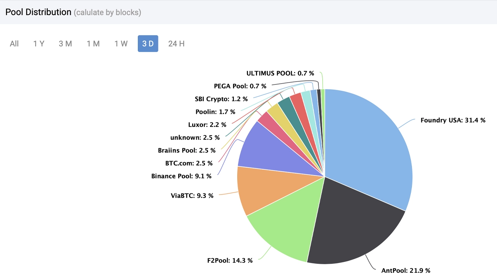
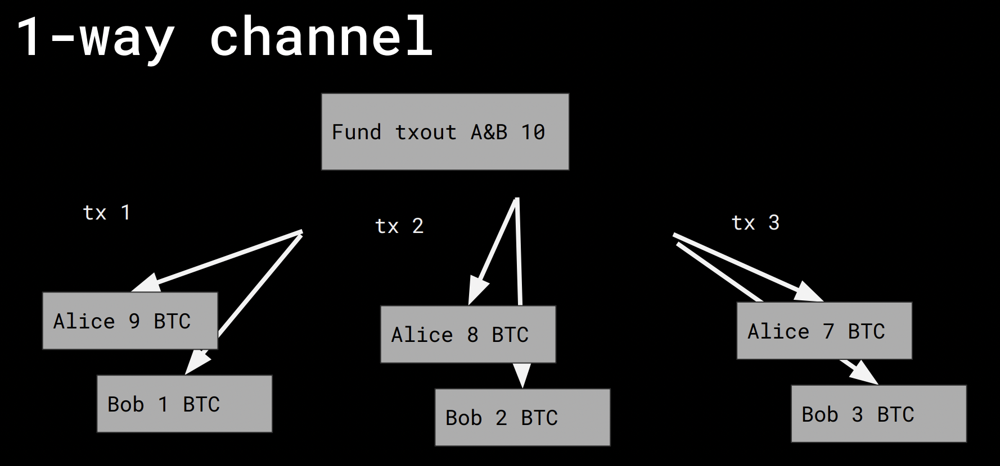

# MIT Cryptocurrency Course

# 1. Signatures, Hashing, Hash Chains, e-cash, and Motivation

*Signature*

A signature is basically an interface with 3 methods:

- generateKeys() --> public, private key
- sign(private_key, message) --> message_signature
- verify(public_key, message, message_signature) --> boolean


# 2. Proof of Work and Mining

Raft, Paxos, etc algorithms can handle nodes going offline, but they don't work for malicious nodes.

**Sybil attack** - when a bunch of malicious nodes crowd out the good nodes when getting distributed consensus
    - To prevent a sybil attack, you need to make creating an identity costly

We can say we have a lot of work, if we can get a large number of leading zeros in a sha256 hash, for example

**Leading Zeros**
echo "Tadge 4233964024" | sha256sum

The bitcoin mining algorithm isn't actually the number of leading zeros, but it looks for a hash less than a specific number, which can be adjusted.

000000007e9f5bb5a25b6a0d1512095bd415840a94e2f2fe93386898947dcb07

8 zero's is 4 bytes or 2^32 attempts needed

For example in the above message, 4233964024 is the nonce

message - m
    mₙ = (data, hₙ₋₁)
nonce - r (a number)
target - t - a number that we need to be less than
hash(m, r) = h; h < t

e.g.

m₂ = (data₂, hash(data₁, nonce₁) )

**Mining Adjustment**

A mining adjustment happens every 2016 block.  The algorithm looks at the time of the current block, and the block that was mined 2016 blocks ago.  If the timestamp of the current block minus the last timestamp adjustment block is equal to two weeks, no adjustment is made.  But, if the delta is greater than two weeks, the algorithm is made easier, but if the delta is less than two weeks, the work is made harder.

**Block Anatomomy**

Prev: Previous Hash
msg: current message
nonce: nonce for work

The hash of the above things are used as an identifier for a given block, so it can be used as a "previous" pointer to "chain" the blocks together

*Interesting* - The bitcoin nonce space isn't big enough, so you need to put a nonce in the msg of a bitcoin transaction


# PART 4 : UTXO Model and Transactions

A replay attack is when you broadcast the same transaction twice...

Input:

- prev tx id
- scriptSig - unlocking script
- index

Output:

- scriptPubKey - locking script
- value


**Consensus Rules**

- Sum(inputs) >= Sum(outputs)
    - except for "coinbase" transactions
    - why not equal? fees

A fee is implicit... it is the difference between the sum of the inputs and the sum of the outputs

- For every input, eval(scriptSig + scriptPubKey) == true

- output has not already been spent

- lock_time?

**Script Sig & Script Pub Key**

Made up of op-codes, that specify how you can spend a transaction

## Pay to Pub Key Hash (P2PKH)

Pay money to a public key

**Script Pub Key (Output)**
```
OP_DUP OP_HASH160 <H(pubkey)> OP_EQUAL_VERIFY OP_CHECKSIG
```

**Script Sig (Input)**
```
<Sig> <pubkey>
```

- Every node runs a bitcoin script interpreter.  This interpreter is called "Consensus critical"
- There is a standard set of script pub keys... anything else won't be guaranteed to be useful
- The opcodes are NOT turing complete in bitcoin, so you can better estimate how much CPU resources will be used
- There are valid transactions in bitcoin but "non-standard" and the bitcoin nodes, may not propogate those around
- Utxos can be blacklisted, so these aren't entirely fungible
- There are around 30 million UTXOs
- The UTXO set is around 3GB
- The accumulation of UTXOs is a bit problem especially because a lot of them are very small

**CoinBase Transaction**
    - The company Coinbase is named after this
    - It is the first transaction in a block, it gives out the block reward to the miner
    - It has inputs, but they are meaningless
    - It gives out the block reward plus the fees which is the sum of all transactions in the block

As an aside, I would assume that if the fees don't increase... or we don't increase the block size then that would mean miners will get less and less reward over time as we continue to half... so either Bitcoin becomes worth billions of dollars... or the whole thing falls apart :/

One risk of bitcoin... if there is a bitcoin halving and the price doesn't increase and the total fees don't increase either, it may become uneconomical to mine bitcoin and the whole thing will fall apart.

# 5. Synchronization Process and Pruning

- The block header is the message you must hash to get the low output value... it's not actually the entire block.  Headers have a hash of all of the transactions in a block.

The headers are really the thing that's chained together... not actually the blocks, you could think of it as a "headerchain"

- A merkle tree is just a hashing of previous transaction ids


### Bitcoin Headers

- version: 4B - used for signalling protocol changes, not really used anymore
- prev_hash: 32B - hash of prev block
- merkle_root: 32B - hash of all transactions in the block
- time: 4B - unix timestamp, in practice it is very unreliable, the main purpose is for adjusting the difficulty.  In general the rule of thumb is that you would reject a timestamp +- two hours from your computers internal clock
- difficulty: 4B - PoW target 
- nonce: 4B - anything goes there

The most a difficulty can go up after 2016 blocks is 4x,  so it can go up or down 4x, but not any faster

You can use the low bits of the time field as part of the nonce

### Downloading Bitcoin

- There is an Initial Block Download (IBD), where first you download all the headers, and then you download the blocks.  You can get the details from a few hardcoded DNS servers in the bitcoin source code.

It starts with the genesis block, and you make all of the bitcoin transactions on top of it.

### UTXO DB

Unspent Transaction Output DB
It is a key-value store

key: transaction Id + index
value: output (script sig + 8byte nonce)

Every time you receive a transaction, validate all of the inputs, make sure the signature is good, make sure you're spending things that exist in the UTXO set.  Then delete the transaction from the UTXO DB

1. Listen for an incoming transaction
2. Validate transaction
3. Delete consumed inputs
4. Add all new UTXOs

Most of the transactions have been spent, so you might have downloaded 170GB, but left with ~3.2GB

The risk is that the blockchain will keep getting bigger and bigger

You can prune/delete blocks with no security loss

Some people need to seed/leech

### Bitcoin node files

banlist.dat - bad nodes
chainstate/
peers.dat - good nodes
wallet.dat - bitcoin wallet data
bitcoin.conf - config file
blocks/
database/ - nothing?
debug.log - log files, rotate
mempool.dat

**mempool** transactions you've seen but not added to the blockchain yet

- Blockchain is a terrible database
    - You can't query a transaction directly from the blockchain, it's only an index of blocks... but not transactions

- op_return outputs don't get stored in the chainstate because it's not spendable
- In order to calculate balance of a bitcoin wallet based on a hash of a public key, you need to scan through the entire chainstate.  It doesn't index on PKScript, only txId:index

# 6. Wallets and SPV

How to pay people and how to get paid? This is called a "wallet"

**Receive Money**

- Most output scripts are P2PKH (Pay to Public Key Hash)
    - The opcodes are the same with only the hash changing
- Bitcoin addresses are in a specific format
    - The last 4 bytes are a checksum

## BIP 32

- Create a Heirarachical Deterministic (HD) wallet
- It allows you to use one private and public key to generate many public and private keys all deriving from the same pub keys
- Check if you've gotten money by iterating through every public key hash and look at every UTXO, if the UTXO matches your Public Key hash, you have money
- You can keep a private key offline, and generate n public keys based on a single public key.  Only when you want to spend money would you need a private key
- To spend money you look through your UTXOs and use them as inputs to the next output transaction

```
Wallet public key = pubkey + hash(randomizer, 1)*G
Wallet Private Key = secret_key + hash(randomizer, 1)
```

Where `G` is 

**G is a point on an elliptic curve ie: (prefix, x, y)**
- prefix: 04
- x: 79BE667E F9DCBBAC 55A06295 CE870B07 029BFCDB 2DCE28D9 59F2815B 16F81798 
- y: 483ADA77 26A3C465 5DA4FBFC 0E1108A8 FD17B448 A6855419 9C47D08F FB10D4B8

## Bitcoin Address Formats

- **P2PKH/Legacy Address** 
    - Pay to pub key hash
    - First version of a bitcoin address
    - Starts with a number `1` and has 26 to 36 characters
    - ex: 1A1zP1eP5QGefi2DMPTfTL5SLmv7DivfNa
    - Highest transaction fees
- **P2SH**
    - Pay to Script Hash
    - Starts with a `3`
    - Lower transction fees
    - example: 3GRdnTq18LyNveWa1gQJcgp8qEnzijv5vR
- **Bech 32/P2WPKH**
    - All lowercase
    - Not supported by all wallets (relatively new)
    - Used in segwit
    - Starts with `bc1`
    - example: bc1qnkyhslv83yyp0q0suxw0uj3lg9drgqq9c0auzc

## Spending UTXOs

- You need to have your inputs <= outputs
- There is some optimization on the "ideal" way to spend an UTXO
    - Should you spend the largest UTXO?
    - Should you combine UTXOs together... etc.

## SPV (Simplified Payment Verification)

- A Lite node
- A step below running a full node
- Can verify work without much data
- Essentially, you have a full node do all the work, and you only copy the relevant parts from you, but now you have to "trust" the full node


**Steps for SPV Node**
1. Connect to a full node
2. Download all headers and verify them
3. Tell full node your addresses
4. Ask if you've gained or lost UTXOs
5. Verify merkle proof of response transactions

**Merkle Verification**

The full node provides the transaction and the surrounding hashes, so you can hash them together to "prove" that they match the header.  This is known as sending the "merkle branch", so you can hash the relevant transactions together in order to verify the merkle root.s

**SPV Problems**

- Tell full node all of your addresses -- you lose all of your privacy
- A full node may not actually tell you that you gained or lost addresses
- Merkel Proofs show "inclusion", not "exclusion".  IE, we can only verify what was sent... but if we miss something we can't prove that our public key wasn't used in a missed transaction
- You can't verify transaction fees
- Can't verify a signature

**NESPV Not Even SPV**
- Use an API to query what your balance is
- The API can lie about what balance you have, and you have no way of trusting it.

# 7. Catena: Efficient Non-Equivocation

Catena - is a project built by MIT students that is a bitcoin based "Append only log"

Computation is cheap... Bandwidth is expensive

- You can embed data onto the blockchain with an [OP_RETURN](https://en.bitcoin.it/wiki/OP_RETURN) command.  The command makes a bitcoin "proveably unspendable"

**Non-Equivocation:** - Saying the same thing to everyone, for example in bitcoin everyone sees the same blockchain.  It "could" be false, but everyone sees it.

**Equivocation** - Saying different things to different people


A **public key directory** is a mapping of people to public keys, for example Bob has public key bc1qnkyhslv83yyp0q0suxw0uj3lg9drgqq9c0auzc

- Blockstack and Keybase are public key directories, meaning they map usernames to public keys

# 8. Forks

- Can one block point to two previous blocks? No
- Can two different blocks point to the same previous block? Yes

This is bad... but the chain with the most hash power ie: the longest chain will win

- A node runs it's own copy of the blockchain, and decides if it will add a new block based on validation rules
    - < 1 MB blocks
    - Valid Transactions
        - For each input script pubKey + scriptSig == true
        - nLockTime
    - Proof of Work
    - No double spends
    - block timestamps - if the timestamp is +- 2 hours from my timestamp, it's rejected
    - Prev block hash pointers - it needs to point to prev node
- The fewer transactions in a block... the fewer transaction fees, so the less a miner would earn from a block

Sometimes validation rules need to be changed, but you can't get everyone to upgrade at the same time, this causes a fork

- A node will never accept a chain with a single invalid transaction... which means that miners have less power than nodes... because the miners create the transactions but the node decides which transactions should be added to the blockchain

**Soft Forks**
- Backwards compatible
- Only add new rules,   old-rule nodes will see new blocks as valid
- For example a new validation rule that blocks <2 MB are valid... this is a hard-fork because the old nodes would have rejected the 1.7MB block


**Hard Forks**
- Not backwards compatible

- The only changes that will create a fork are ones that update the validation rules... if we don't update the validation rules then it's not considered a fork, it's only a software updates

Miners Create blocks... nodes validate blocks

# 10. PoW Recap and Other Fork Types

- Proof of work can scale very large
- The "luckiest" block is a way of estimating the total amount of work done in the bitcoin network.  Ie: it's lucky because it has more leading zeros than required

- If a "non-standard" transaction is received by a full node, it can be rejected... but if the non-standard transaction is in a block it will normally be accepted

**Soft Forks** - Adding new rules
**Hard Forks** - Changing rules so they aren't backward compatible  


**Evil Fork/Firm Fork** - A hard & soft fork, that looks like a soft fork to non-adopting nodes
    - Done by making the Proof of Work on the new chain, an empty but valid block on the old chain!
    - has not been attempted
    - This could be done by the miners meaning they could force whatever consensus rule they wanted on the nodes because the nodes would accept it even though things have changed on a different change


- An evil fork is very possible due to the fact that 53% of all mining power is controlled by two mining pools



**BIP 9** - Miners signal support for a soft fork... once 95% of them say they support it, then the fork activates...
    - Doesn't really work in practice... ie no-one does this.

# 11. Fees

- A transaction fee is the sum between the input amounts and the output amounts.
- Fees are implicit

Typically fees are satoshis/byte

- Transactions are chosen by the miners
- The sender will pay the fee

Miners sort the transactions by fee rate, choose the top ~1MB of transactions by fee, and then calculate the merkle root

If you set a fee too low, then a transaction won't confirm... But it's possible to have a transaction fee of zero

**Child Pays For Parent** - Send a transaction to yourself with a high fee
    - This creates more problems because we're increasing the total number of transactions
    - Dependency graphs can be complex

**Replace By Fee** - Double spend the transaction with a higher fee
    - hurts security of unconfimed transactions
    - zero conf transactions have no security anyways
    - Show unconfirmed transactions?
    - Every node can run it's own

- A lot of people overpay on fees
- The halving rewards get negligible sooner than you think

- If there are no new coins to mine, there is no incentive to mine, if fees are near zero there is no incentive to mine

- Miners will fight over the same block height

- The solution to having a stable system long term is to always have a backlog for bitcoin ie smaller blocks

# 12. Transaction Malleability and Segwit

**malleability** - When you modify a ciphertext, messages, signatures, etc. and things still 'work'.  For example in Bitcoin transactions can be changed and still be valid.

- You sign an entire bitcoin transaction... except the signature because you can't sign a signature.  So you can remove a signature fields, sign, and then put the signature back in.  If you cahnge any bit of the signature the transaction is "invalid".

- A txid is a hash of the entire message *including the signature*

**Segwit (Segregated Witness)** - A better name is separate signatures.  It is where you don't include the signature in a transaction id; transactions are defined by input pointers and outputs only.  Signatures changes but the transaction id doesn't.

Output: 0 <pubkey hash> sig script: <nothing>

You end up with a pubkey hash on top of the stack, which is non-zero and the coins move.  This is no a "pay to pub key hash", but the "witness/signature" has been put somewhere else.  The old software never sees this, but newer software does.


- The nodes will argue on the size of the transaction
- The old nodes don't see the witness field; the witness doesn't count towards the 1MB block size limit... it's essentially a soft fork

# 13. Payment Channels and Lightning Network

- Blockchains don't scale well

**1 Way Channel** - You have a shared balance between two parties, and you can send balance one way without making a transaction on the blockchain

- This is based on "lock time/block time" fields, where a transaction is only valid after a specific block time or height

- **blocktime** - The transaction is not valid until after this unix time.
- **locktime** - The transaction is not valid until after this block. 

**A payment Channel** is a multisig output with 2 of 2 signatures required

There are a few steps to creating a payment channel.

1. Alice creates, but does not sign a funding transaction.  The funding transaction has an output of an Alice and Bob multisig with X coins.

The funding transaction is where Alice sends X coins to a multisig controlled by both Alice and Bob

2. Alice sends the funding transaction details to Bob, and Bob uses it to create a refund transaction.

The refund transaction uses the funding transaction as an input with all of the money going back to Alice.  But the refund transaction has a lock time in the future.

3. Bob signs the refund transaction and sends it to Alice.  But the refund transaction isn't broadcasted... Alice just has it on disc.
4. Alice can now safely sign and broadcast the funding transaction since she now has the refund transaction
5. Alice now can send n payments to bob with her signature from the funding transaction off-chain.  Where the input to the payment is her funding transaction ID.  
6. BOB takes the payment from Alice and broadcasts it at the end of their transactions... before the refund locktime is up... once he broadcasts the received transaction then Alice's refund transaction is invalid because you can't double spend the coins from the same input.

This allows alice to broadcast transactions one way to BOB offchain... in increasing increments.  For example, if you wanted to send money for video streaming, every time you streamed a video you could do this transaction.

- The old transactions are useless
- BOB needs to sign and broadcast one of these transactions before the refund transaction is sent

## Funding Transaction
- open the payment channel to BOB

But alice creates a refund transaction with a locktime in the future

## Refund Transaction
- A get out of jail free card, to get the money back if BOB goes away


## Payment Channel
- Alice creates transactions using the funding transaction as an input, and sends to BOB. She can send as many transactions she likes to BOB as long as they are increasing.



## Lightning Network

- A bidirectional payment channel that can last forever
- Can you delete/revert old transactions?

*OP_CHECKSEQUENCE_VERIFY (CSV)* - A relative locktime, meaning a transaction is spendable after X blocks or Y seconds in the future.  But it is not spendable before then.  i.e. you need to wait for n confirmations to be able to spend if not the tx fails.
*OP_CHECKLOCKTIME_VERIFY* - An absolute locktime opcode.  This says the transaction must be spend AFTER block n, else it will fail.

You can use the above opcodes to conditionally revoke... e.g.

```
(keyA && keyB) || (keyC && 100 blocks)
```

Meaning, keyA and keyB can spend at any time, OR keyC can spend, but it must wait 100 blocks.


The lightning network does Bitcoin transactions off-chain.  The idea is that two people can send transactions to each other invalidating older transactions.  For example, Alice and Bob can agree that Alice has 2 bitcoin, and Bob has 8 bitcoin.  But it is possible to create a new transaction where Alice has 3 Bitcoin and Bob has 7 Bitcoin, and the previous Alice:2 and Bob:8 transaction is invalid.

For example:

State 0 -- Alice:8, Bob:2
State 1 -- Alice:5, Bob:5
State 2 -- Alice:2, Bob:8
...

Each state can be closed (by commiting to the blockchain)  at any time by either party.  Each state is created with a pair of "Commit Transactions".  The each commit transaction says that Alice has X bitcoin and Bob has Y bitcoin.  But the idea is if you lie about deleting a previous transaction, then you can spend all of the other persons money.  Because you give the other party a "Redeem Transaction", which makes them able to spend your coins if they broadcast it.

To invalidate previous states Both Alice and Bob can reveal private keys to their money "proving" that they won't broadcast the transaction or else the other person can take all the money.

But one catch is both Alice and Bob need to keep track of the other person's revocation keys, so the longer the payment channel is open... the more revoke keys you'll need to keep track of, until the payment channel is closed.  Although there are some optimizations where you can potentially store log(n) revokation keys by using a merkle tree like data structure.


It is possible to link these channels between multiple nodes, which can forward transactions to each other.  Each forwarding transaction between lightning nodes can charge an optional fee, although it will likely be pretty low.